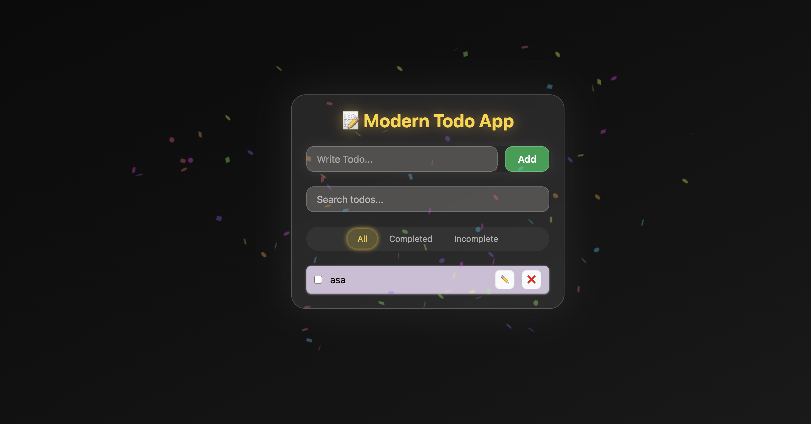

# 📝 Modern Glassmorphism Todo App

A beautifully designed Todo app built with React, Tailwind CSS, and Framer Motion — featuring glassmorphism UI, animated filter tabs, confetti, and localStorage persistence.

---

## 🚀 Live Demo

🔗 [View Live on Vercel](https://todo-app-orpin-eta.vercel.app/)

---

## 📸 Screenshots

|  |

---

## ✨ Features

- 🧊 **Modern UI** with glassmorphism, shadows, glow effects
- 🔥 **Add / Edit / Delete / Toggle** todos
- 🎉 Confetti on first visit
- 🔍 Real-time search
- 🎛️ Animated filter tabs: All / Completed / Incomplete
- 💾 Persistent with `localStorage`
- 🧠 Global state via React Context API
- ✅ Toast notifications via `react-hot-toast`
- ⚡ Smooth transitions with `framer-motion`

---

## 🛠️ Built With

- [React](https://reactjs.org/)
- [Tailwind CSS](https://tailwindcss.com/)
- [Framer Motion](https://www.framer.com/motion/)
- [Canvas Confetti](https://github.com/catdad/canvas-confetti)
- [React Hot Toast](https://react-hot-toast.com/)
- [Vercel](https://vercel.com/) for deployment

---

̀
